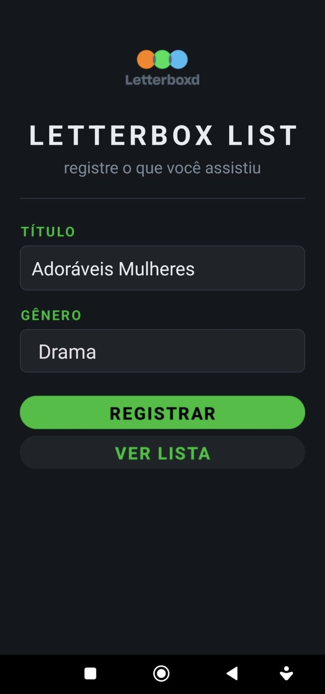
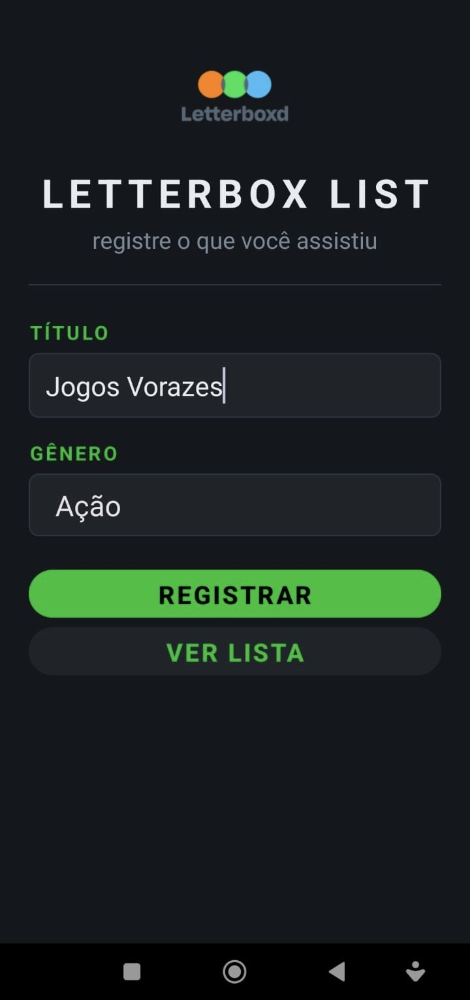
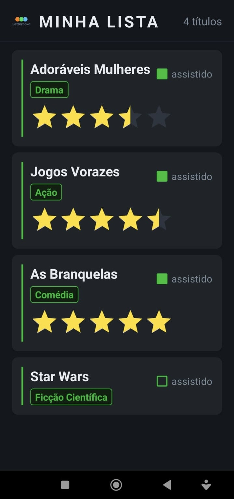

# 🎬 App Android - LetterboxdList

Aplicativo Android desenvolvido em **Kotlin** para registrar e avaliar filmes e séries assistidos, inspirado na interface do **Letterboxd**.

---

## 📋 Funcionalidades

### 1. 🎥 Tela de Registro (`MainActivity`)

O usuário informa o **nome** e o **gênero** do título através de um campo de texto e um Spinner. Ao clicar no botão, o título é salvo na lista em memória.

**Comportamento:**
- Campo nome preenchido → adiciona o título à lista via `TituloDaoImpl`
- Botão **"VER LISTA"** → navega para `ListaActivity`

---

### 2. 📋 Tela de Lista (`ListaActivity`)

Exibe todos os títulos registrados em um `RecyclerView` com cards estilizados.

**Dados exibidos por item:**
- `Nome` do filme/série
- `Gênero` em badge destacado
- `CheckBox` para marcar como assistido
- `RatingBar` (5 estrelas, passo 0.5) — aparece apenas quando marcado como assistido

**Comportamento:**
- Marcar checkbox → exibe a RatingBar para avaliação
- Desmarcar checkbox → oculta a RatingBar e zera a nota
- Avaliar com estrelas → salva a nota (`Double`) no objeto `Titulo`

---

## 📸 Screenshots

<table>
  <tr>
    <th align="center">📝 Registro de Título</th>
    <th align="center">📝 Registro de Título</th>
    <th align="center">📋 Lista de Títulos</th>
  </tr>
  <tr>
    <td align="center"></td>
    <td align="center"></td>
    <td align="center"></td>
  </tr>
</table>

---

## 🗂️ Estrutura do Projeto

```
app/src/main/
├── java/br/edu/fatecpg/letterboxdlist/
│   ├── adapter/
│   │   └── TituloAdapter.kt
│   ├── dao/
│   │   ├── TituloDao.kt
│   │   └── TituloDaoImpl.kt
│   ├── model/
│   │   └── Titulo.kt
│   └── view/
│       ├── MainActivity.kt
│       └── ListaActivity.kt
└── res/
    ├── drawable/
    │   ├── letterboxdlogo.png
    │   ├── bg_edittext.xml
    │   ├── bg_spinner.xml
    │   └── bg_genero_badge.xml
    ├── layout/
    │   ├── activity_main.xml
    │   ├── activity_lista.xml
    │   └── item_titulo.xml
    └── values/
        ├── colors.xml
        └── strings.xml
```

---

## 🧩 Modelo de Dados

```kotlin
data class Titulo(
    val nome: String,
    val genero: String,
    var isAssistido: Boolean = false,
    var nota: Double = 0.0
)
```

---

## 🛠️ Tecnologias

- **Linguagem:** Kotlin
- **SDK mínimo:** Android 21+ (Lollipop)
- **Componentes:** `RecyclerView`, `CardView`, `CheckBox`, `RatingBar`, `Spinner`, `EditText`
- **Padrão de dados:** Interface `TituloDao` + `TituloDaoImpl` com `companion object`
- **Arquitetura:** Activity-based com Adapter pattern

---

## ▶️ Como executar

1. Clone o repositório:
   ```bash
   git clone https://github.com/seu-usuario/seu-repositorio.git
   ```
2. Abra o projeto no **Android Studio**
3. Conecte um dispositivo ou inicie um emulador
4. Certifique-se que a **Depuração USB** está ativada no dispositivo
5. Clique em **Run ▶️** (ou `Shift + F10`)
